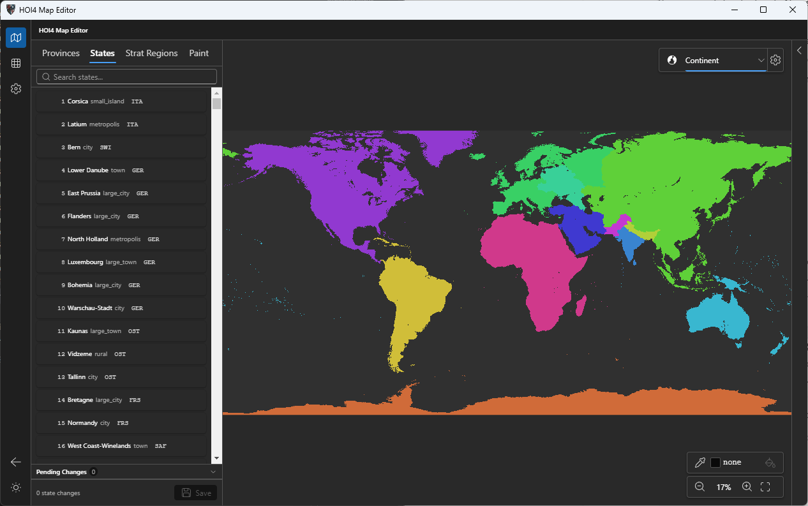
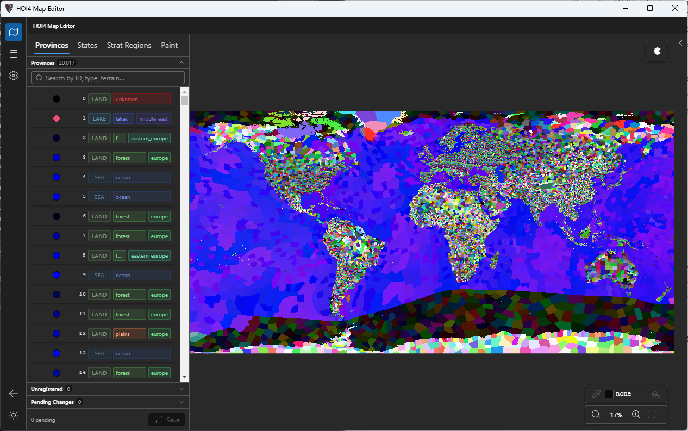
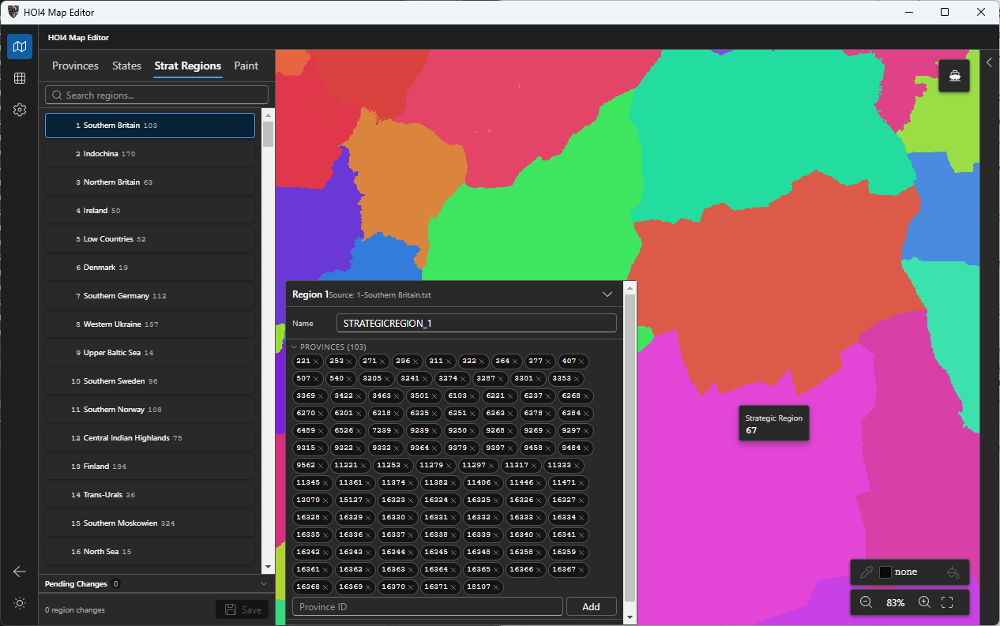
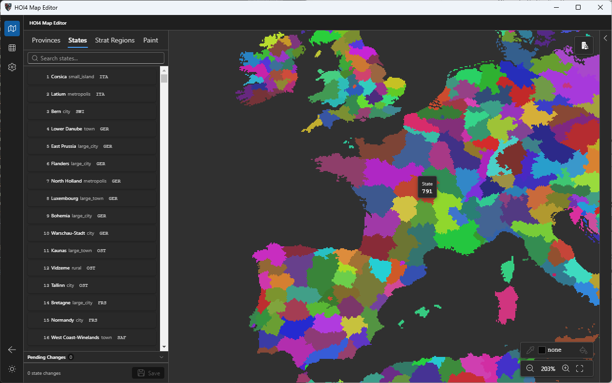

# Clausewitz Map Editor

A desktop editor for **Clausewitz** game map mods. It opens a HOI4 mod (or the base
game files), reads the map-related game data, and lets you inspect and edit it against
a live, hardware-accelerated view of the province bitmap.



## Features

- Browse and edit **provinces** — id, color, type (land/sea/lake), terrain, continent,
  and coastal flag — reconciled against the underlying `provinces.bmp`.
- Browse and edit **states** and **strategic regions**, including their province
  membership, owners, and categories.
- Paint province colors directly on the map, with pending-change tracking before saving.
- Fast WebGL-rendered map view for province sets in the tens of thousands.

| Provinces | Strategic Regions | Paint |
|---|---|---|
|  |  |  |

## Running the project

Prerequisites: **Node.js 18+** and npm.

```bash
npm install        # install dependencies
npm run dev        # launch the app in development (electron-vite, with HMR)
```

## Building

```bash
npm run build      # type-check + build main/preload/renderer into out/
npm run package    # build + produce a distributable installer via electron-builder
```

On first launch the app asks you to point it at your HOI4 game folder and/or a mod folder;
recently opened projects are remembered for next time.
