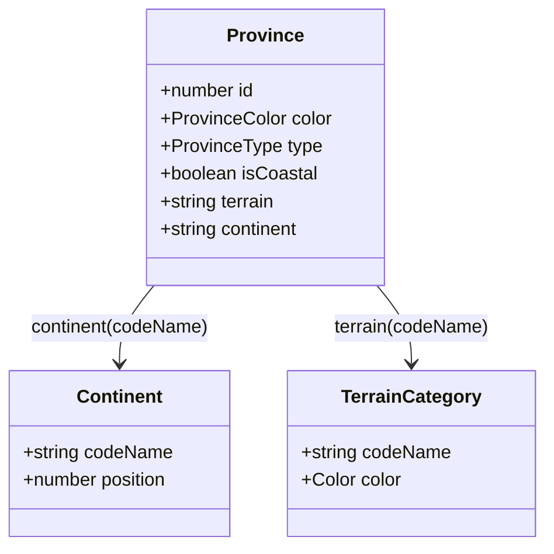
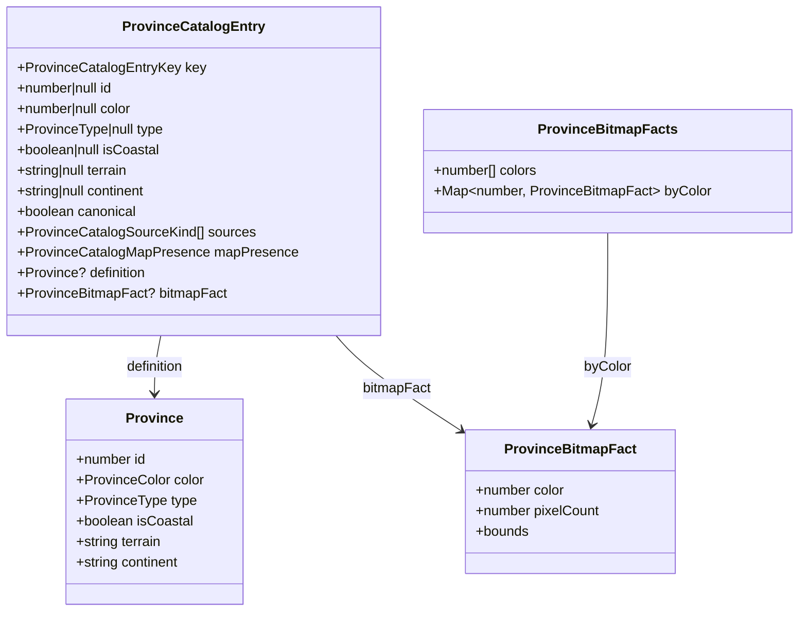
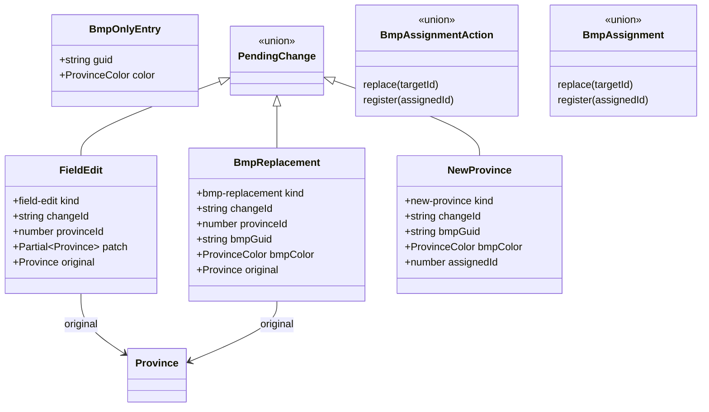
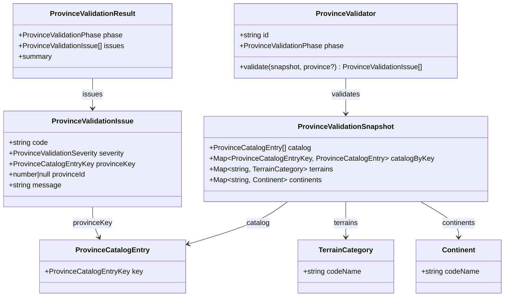

# Province Model

This document captures the shared province-facing interfaces and contracts used by the editor.

## Core Model



## Catalog Model



## Editing Model



## Validation Model



## IPC / API Contract

```mermaid
classDiagram
    class MapDataSnapshot {
      +Continent[] continents
      +Province[] provinces
      +ProvinceCatalogEntry[] provinceCatalog
      +TerrainCategory[] terrains
      +string provincesImageB64
    }

    class MapChangedEvent {
      +string projectId
      +type: continents|definitions|terrain|image|states|strategicRegions
      +data
    }

    class "ApiContract.map" as ApiContractMap {
      +load(projectId) Promise~MapDataSnapshot~
      +save(projectId, provinces, continents) Promise~void~
      +loadStates(projectId) Promise~void~
      +loadStrategicRegions(projectId) Promise~void~
      +onChanged(callback) unsubscribe
    }

    class Province {
      +number id
    }

    class Continent {
      +string codeName
    }

    class ProvinceCatalogEntry {
      +ProvinceCatalogEntryKey key
    }

    class TerrainCategory {
      +string codeName
    }

    ApiContractMap --> MapDataSnapshot : load()
    ApiContractMap --> Province : save(provinces)
    ApiContractMap --> Continent : save(continents)
    MapDataSnapshot --> Province : provinces
    MapDataSnapshot --> ProvinceCatalogEntry : provinceCatalog
    MapDataSnapshot --> TerrainCategory : terrains
    MapDataSnapshot --> Continent : continents
```
